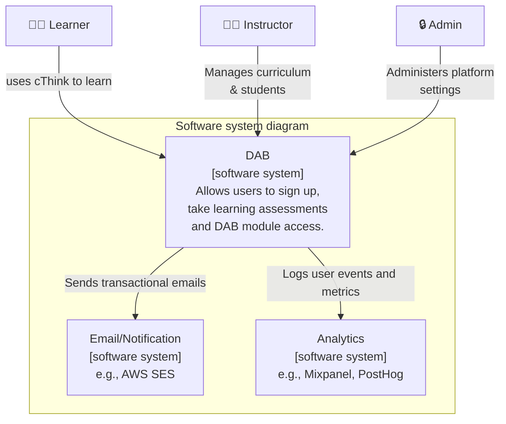

# cThink – System Context Diagram

```mermaid
graph TD
    L[🧑‍🎓 Learner] -->|uses cThink to learn| C[cThink System]
    I[🧑‍🏫 Instructor] -->|Manages curriculum <br> & students| C
    A[🔒 Admin] -->|Administers platform <br> settings| C

    C -->|Sends transactional emails| E[📧 Email/Notification System]
    C -->|Logs user events and metrics| AN[📊 Analytics Platform]

    subgraph Software system diagram
        C["DAB <br> [software system]<br> Allows users to sign up, <br> take learning assessments <br> and DAB module access."]
        E["Email/Notification <br> [software system] <br>e.g., AWS SES"]
        AN["Analytics <br> [software system]<br>e.g., Mixpanel, PostHog"]
    end
```